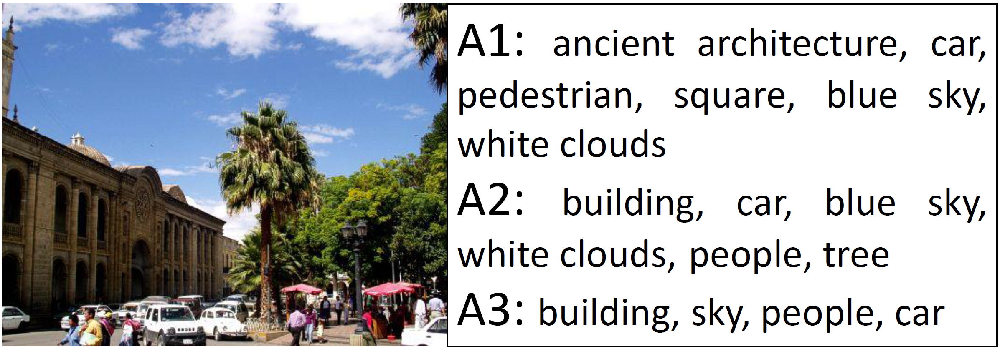
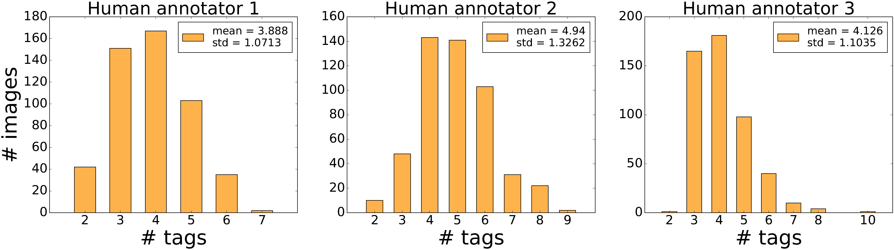
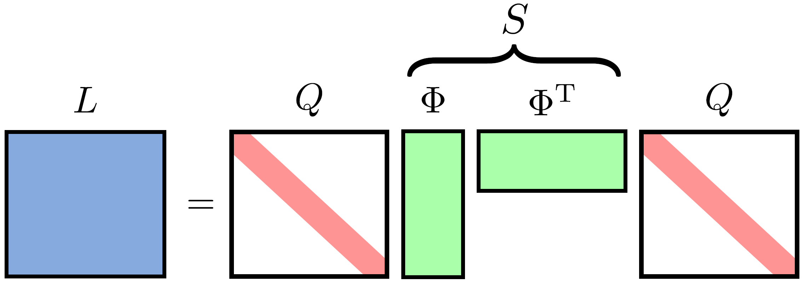
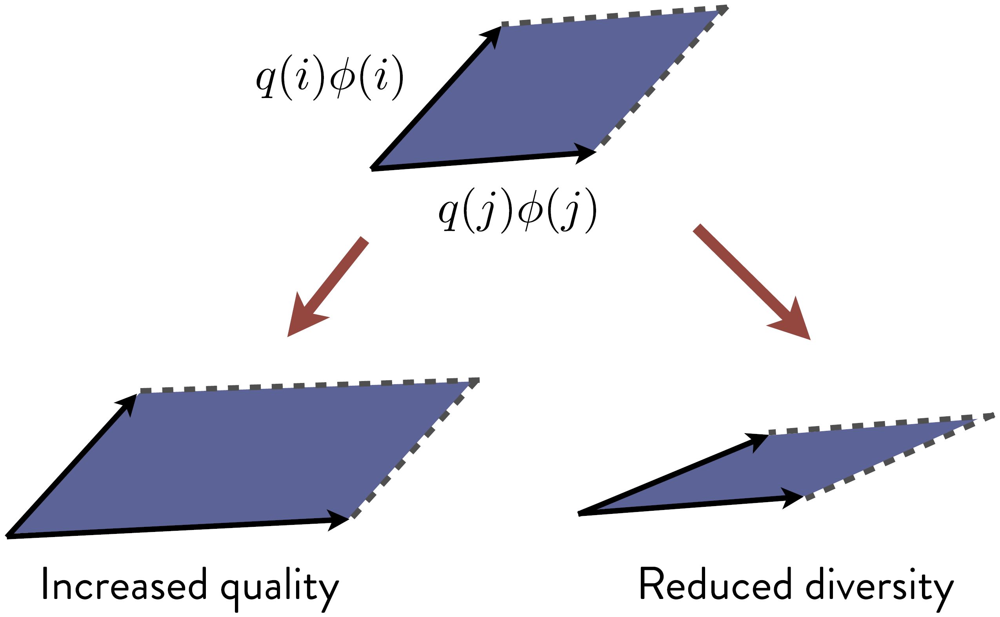

# Diverse Image Annotation (CVPR 2017)
 
This project introduces our work "Diverse Image Annotation" published at CVPR 2017. 

```
@inproceedings{wu-dia,
  title={Diverse Image Annotation},
  author={Wu, Baoyuan and Jia, Fan and Liu, Wei and Ghanem, Bernard},
  booktitle={Proceedings of the IEEE Conference on Computer Vision and Pattern Recognition},
  year={2017}
}
```
The goal of diverse image annotation (DIA) is to cover as much useful information of an
image as possible using a limited number of tags. 
It requires the tags to be not only representative to
the image, but also diverse from each other to reduce redundancy. DIA can be seen as a redefinition of the automatic image annotation (AIA), to encourage the results of AIA to be more close to human annotations.


Motivations from Observations of Human Annotations
----
In current automatic image annotation (AIA), the general target is to predict most relevant tags of the image. 
However, we find that there are obvious differences between the results of AIA and the ones of human annotations, 
at both the number of predicted tags and the quality of the predicted tag subset.  

Let's start with an observation of how human annotates images. We conduct a subject study by asking 3 human annotators to annotate 500 test images of IAPRTC-12 independently, with the instruction "cover the main contents of one image using a few tags". 
Based on the human annotation results, we have two observations:
```
1. In each annotation, it is rare to give redundant tags together (see Fig 1).
2. The number of annotated tags of all annotations lay in a small range, with the average around 4 (see Fig 2).
```
<!--  -->
 | 
 

Fig 1. Three independent human annotations of one image        Fig 2. Statistics of tag numbers of three human annotators
<!--

Fig 1. Three independent human annotations of one image

Fig 2. Statistics of tag numbers of three human annotators
-->
Observation 1 demonstrates that the semantic reducdancy between tags is considered in human annotations, not only just the relevance of the tag to the image. As a result, the tag subset is semantically compact due to the reduction of redundancy, leading to observation 2. 

In constrast, from many benchmark datasets for AIA (such as ESP Game and IAPRTC-12), we find that in their ground-truth tag subsets: there are many redundant tags in the same tag subset (e.g., person and people); the averaged number of tags are larger than the ones of human annotations (see Fig 2). Consequently, the current AIA models that only consider the relevance and is trained on such benchmark datasets will predict the redundant tag subset with larger-size. 
This demonstrates that both the collection of the ground-truth tag subsets in benchmark datasets and the learning target in current AIA only consider the relevance, while the redundancy between tags are ignored.  

Now it is clear that the gap between AIA and human annotation is due to the tag redundancy. Another word to describe the avoiding of tag redundancy is diversity, which encourages different tags to cover different contents. Thus, we can summarize that human annotators considers both relevance and diversity, while AIA only considers the relevance. This is why we propose DIA to redefine the current AIA. 


Model
----

#### Conditional Determinantal Point Process Model
Determinantal point process (DPP) is a probabilistic model to formulate the diversity of a subset. 
Treating the image annotation as a subset selection problem and the image as the condition, the 
conditional DPP is adopted to formulate DIA, as follows:
$$
\mathcal{P}_{\mathbf{W}}(\mathcal{Y}|\mathbf{x}) = \frac{ \text{det}(\mathbf{L}\_{\mathcal{Y}}(\mathbf{x}; \mathbf{W}))}{\text{det}(\mathbf{L}(\mathbf{x}; \mathbf{W}) + \mathbf{I})}
$$

where $\mathbf{x}$ denotes the feature vector of the image, $\mathcal{Y} \subset \mathcal{T} = \\{1, 2, \ldots, m \\}$ is the tag subset, with $\mathcal{T}$ being the set of all $m$ candidate tags. 
The positive semi-definite matrix $\mathbf{L}(\mathbf{x}; \mathbf{W})$ denotes the kernel matrix of all $m$ tags, with $\mathbf{W}$ being its parameters. 
$\mathbf{L}\_{\mathcal{Y}}(\mathbf{x}; \mathbf{W})\in\mathbb{R}^{|\mathcal{Y}|\times |\mathcal{Y}|}$ is a sub-matrix generated by extracting the rows and columns corresponding to the tags in $\mathcal{Y}\subset\mathcal{T}$ from $\mathbf{L}(\mathbf{x}; \mathbf{W})$.

$\text{det}(\mathbf{L}\_{\mathcal{Y}})$ indicates the determinant of $\mathbf{L}_{\mathcal{Y}}$, and it is good for encoding negative correlations. There is an elegant geometric illustration to help us to understand the meaning of determinantal, as shown in Fig 3. 

 | 
 

Fig 3. (Left) The kernel matrix $\mathbf{L}$ is decomposed to quality $Q$ and diversity $S$. (Right) $\text{det}(\mathbf{L})$ corresponds to the volume of the blue area. This figure is borrowed from the slides "Jose Miguel Hernandez-Lobato and Hong Ge, An introduction to
Determinantal Point Process, 2014". 

Learning with DPP loss
----
$$
\mathcal{L}(\mathbf{W})  = - \frac{1}{n} \sum_j^n \log \mathcal{P}_{\mathbf{W}}(\mathcal{Y}_j|\mathbf{x}_j) + \frac{\eta}{2} \sum_i^m \parallel \mathbf{w}_i \parallel_2^2
$$


Inference by k-DPP sampling with weighted semantic paths
----
We modify the standard k-DPP sampling process (see 'k-DPPs: Fixed-Size Determinantal Point Processes') 
by inserting the weighted semantic paths. Specifically, during the sampling process, we check that whether 
the newly sampled tag is from the same path with any existing sampled tag. If is, then discard it and do 
the next sampling until convergence; otherwise, adding it into the sampled tag subset. Thus, it can be 
avoided that two tags from the same path are sampled together. 


#### Semantic Paths


